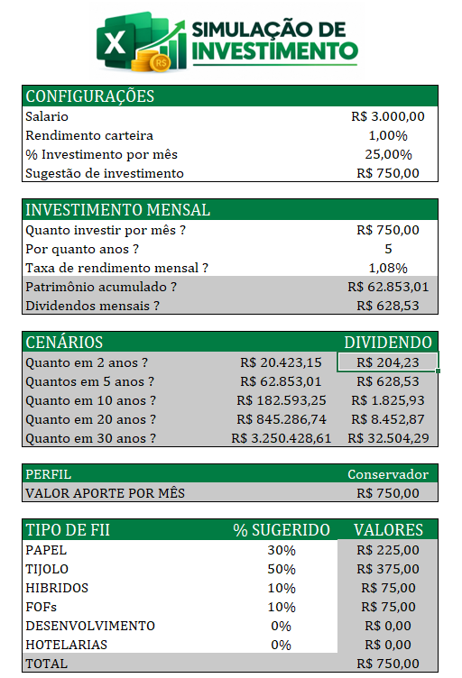
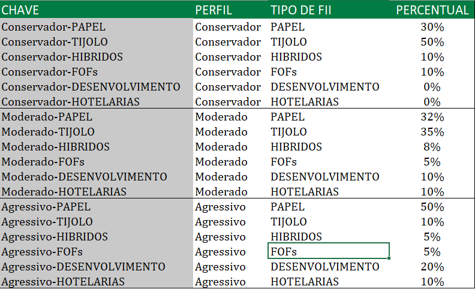

# 📊 Simulação de Investimentos no Excel

## 📌 Sobre o projeto

Este projeto foi desenvolvido para praticar e demonstrar o uso do Excel na criação de uma ferramenta de simulação de investimentos.

A planilha permite definir informações como salário, percentual destinado aos investimentos, rendimento mensal e período de aplicação. A partir desses dados, são realizados cálculos para visualizar a evolução do investimento ao longo do tempo.

O projeto também utiliza diferentes perfis de investidor — Conservador, Moderado e Agressivo — para simular diferentes formas de distribuição dos investimentos.

## 🎯 Objetivo

O objetivo foi colocar em prática conhecimentos de Excel e transformar cálculos e informações financeiras em uma planilha organizada e funcional.

## ⚙️ Funcionalidades

- Simulação de investimentos mensais;
- Definição do percentual destinado aos investimentos;
- Simulação de diferentes períodos de aplicação;
- Cálculo da evolução do patrimônio;
- Simulação de dividendos;
- Distribuição dos investimentos por perfil;
- Comparação entre diferentes cenários.

## 📊 Perfis de investimento

A planilha trabalha com três perfis:

- **Conservador**
- **Moderado**
- **Agressivo**

A distribuição considera diferentes tipos de FIIs, permitindo visualizar uma composição diferente de acordo com o perfil selecionado.

## 🛠️ Ferramentas utilizadas

- Microsoft Excel
- Fórmulas e funções
- Cálculos percentuais
- Referências entre planilhas
- Simulação de cenários
- Organização e análise de dados

## 📚 Aprendizados

Este projeto faz parte do meu processo de aprendizagem em Excel e análise de dados.

Durante o desenvolvimento, pratiquei a criação de fórmulas, organização de informações, cálculos financeiros e estruturação de uma ferramenta para simulação de diferentes cenários.

## 🖼️ Visualização do projeto

### Simulação de Investimentos

### Distribuição por Perfil

## ⚠️ Observação

Este projeto possui finalidade exclusivamente educacional. Os valores, percentuais e resultados apresentados são utilizados para fins de simulação e estudo e não representam recomendação de investimento.
