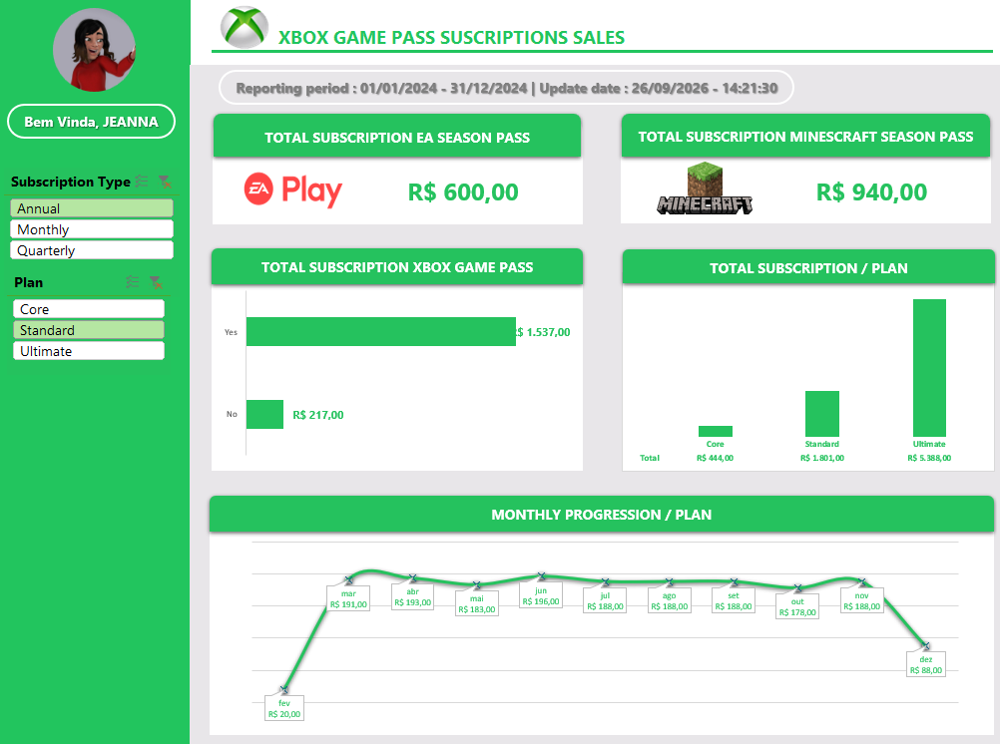

# 📊 Dashboard de Vendas — Xbox Game Pass

## 📌 Sobre o projeto

Este projeto apresenta um **Dashboard de Vendas desenvolvido no Excel** para analisar dados relacionados às assinaturas do **Xbox Game Pass**.

A proposta é transformar dados brutos em informações visuais e organizadas, facilitando a análise de vendas, receitas, planos e comportamento dos clientes.

O projeto faz parte do meu **portfólio de análise de dados**, com foco no desenvolvimento de habilidades práticas em Excel, tratamento de dados, criação de indicadores e visualização de informações.

## 🎯 Objetivo

O principal objetivo é desenvolver um dashboard capaz de apresentar os principais indicadores de vendas de forma simples, visual e objetiva.

Com o dashboard, é possível:
- acompanhar o desempenho das vendas;
- analisar a receita gerada;
- comparar diferentes planos;
- observar a evolução das vendas;
- identificar padrões nos dados;
- facilitar a interpretação das informações por meio de gráficos e indicadores.

## 📊 Dashboard

O dashboard foi desenvolvido para apresentar uma visão geral dos dados e permitir uma análise rápida dos principais indicadores.

### Principais elementos
- Indicadores de desempenho (KPIs);
- Gráficos de vendas;
- Análise de receita;
- Comparação entre planos;
- Distribuição das vendas;
- Filtros para exploração dos dados;
- Visualização organizada dos resultados.

## 🧮 Funcionalidades

O projeto utiliza recursos do Excel para:
- organização e tratamento dos dados;
- criação de tabelas;
- utilização de fórmulas;
- aplicação de filtros;
- criação de indicadores;
- criação de gráficos;
- análise de dados;
- construção de dashboard.

## 🛠️ Ferramentas utilizadas

- **Microsoft Excel**
- Fórmulas e funções do Excel
- Tabelas
- Tabelas Dinâmicas
- Gráficos
- Segmentação de dados
- Dashboard

## 📁 Arquivos do projeto

| Arquivo | Descrição |
|---|---|
| ➡️ [Baixar Dashboard Vendas XBOX GAME PASS](./Dashboard_Vendas_Xbox_Game_Pass.xlsx) | Arquivo principal do projeto desenvolvido no Excel |

## 💡 Principais aprendizados

Durante o desenvolvimento deste projeto, foram praticadas habilidades relacionadas a:
- organização de bases de dados;
- tratamento e análise de informações;
- utilização de funções do Excel;
- criação de indicadores;
- construção de tabelas dinâmicas;
- criação de gráficos;
- visualização de dados;
- desenvolvimento de dashboards;
- apresentação de informações de forma clara e objetiva.

## 📸 Visualizações

Dashboard Vendas XBOX GAME PASS

## Conclusoes

Projeto desenvolvido para compor meu portfólio de **Excel, Análise de Dados e Business Intelligence**.

---

⭐ Este projeto demonstra a aplicação prática do Excel na organização, análise e visualização de dados.
